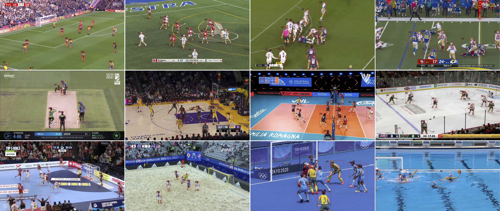

# JEDE: Universal Jersey Number Detector for Sports

This codebase contains code for the paper "[JEDE: Universal Jersey Number Detector for Sports](https://hengyueliu.com/assets/files/JEDE_Universal_Jersey_Number_Detector_for_Sports.pdf)" published on IEEE TCSVT, 2022.

<p align="center">

</p>

## Installation

### Dependencies

Tested on PyTorch 1.8.1.

```
conda install pytorch==1.8.0 torchvision==0.9.0 torchaudio==0.8.0 cudatoolkit=10.2 -c pytorch
pip install opencv-python
```

### TextSpotter v3

```
pip install pyclipper shapely
```


### Our code base and Detectron2

```
git clone https://github.com/liuhengyue/pgrcnn.git
cd pgrcnn
git submodule init
git submodule update
python -m pip install -e detectron2
```

See [installation instructions](https://detectron2.readthedocs.io/tutorials/install.html) for more details on installing detectron2.

## Weights

The weights trained with all images across soccer and basketball videos can be found in the release.


## Dataset Preparation

### Prepare Jersey Number

Currently, the dataset is not released due to policies. But, it will be released in the future.

```
mkdir datasets/jnw
ln -s datasets/jnw detectron2/datasets/jnw
```

### Prepare COCO (Optional)
```
wget http://images.cocodataset.org/zips/train2017.zip
wget http://images.cocodataset.org/zips/val2017.zip
wget http://images.cocodataset.org/annotations/annotations_trainval2017.zip

mkdir datasets/coco
unzip train2017.zip -d datasets/coco
unzip val2017.zip -d datasets/coco
unzip annotations_trainval2017.zip -d datasets/coco

rm train2017.zip val2017.zip annotations_trainval2017.zip
```
### Prepare SVHN (Optional)
```
wget http://ufldl.stanford.edu/housenumbers/train.tar.gz
mkdir svhn
tar -xvzf train.tar.gz -C svhn
rm train.tar.gz
```

## Citations

If you find our work helpful, please cite:
```bibtex
@article{liu2022jede,
  title={JEDE: Universal Jersey Number Detector for Sports},
  author={Liu, Hengyue and Bhanu, Bir},
  journal={IEEE Transactions on Circuits and Systems for Video Technology},
  volume={32},
  number={11},
  pages={7894--7909},
  year={2022},
  publisher={IEEE}
}
```